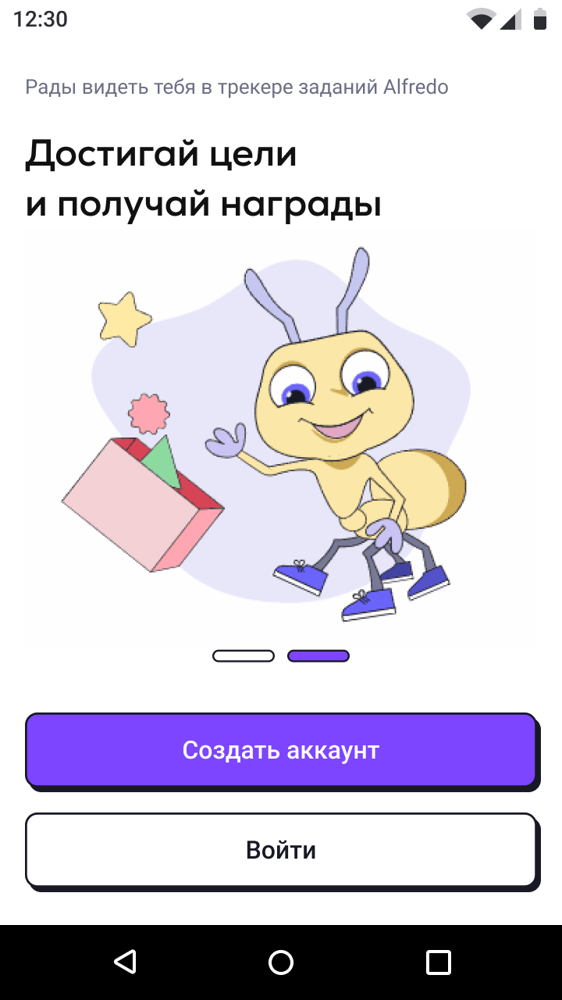
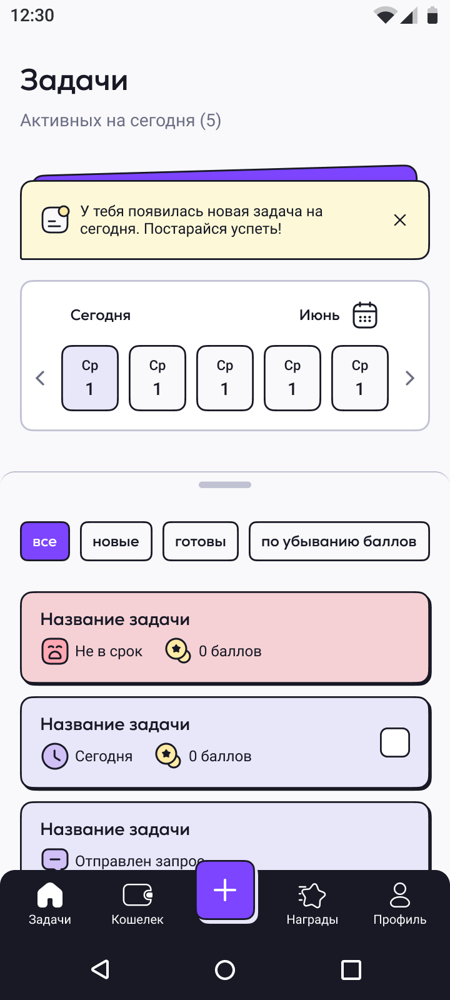
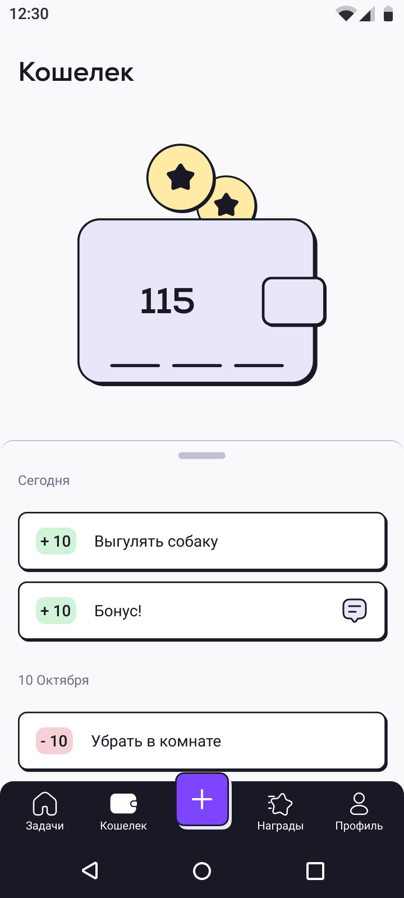
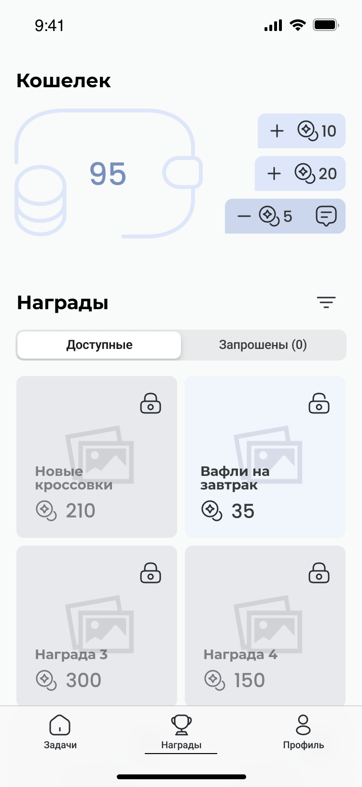
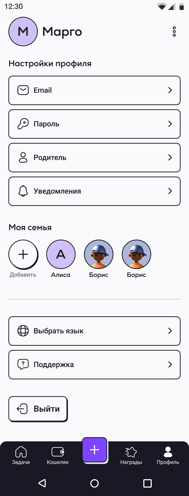
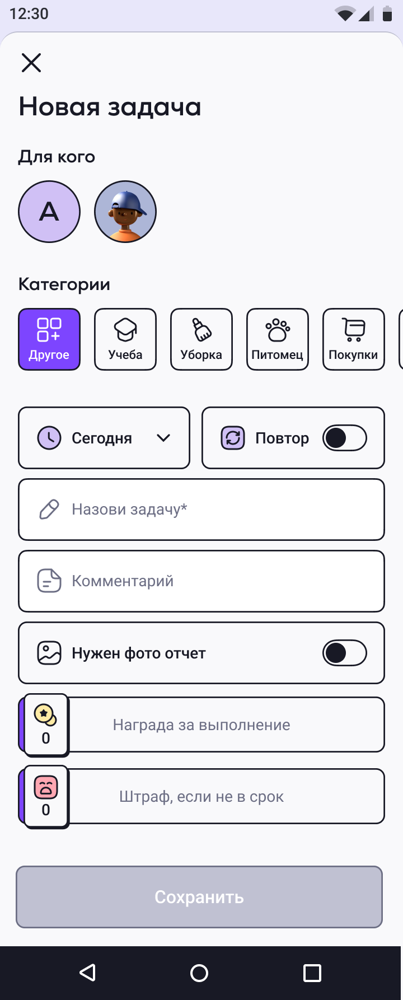
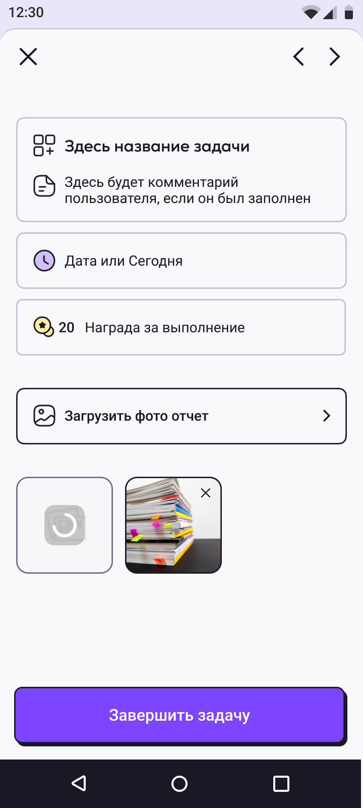

# Требования к проекту

## Введение

### 1.1 Назначение

В этом документе описаны функциональные и нефункциональные требования к мобильному приложению "Household tasks". Этот документ предназначен для команды, которая будет реализовывать и проверять корректность работы приложения.

### 1.2 Бизнес требования

#### 1.2.1 Исходные данные
С каждым днём популярность портативных гаджетов растёт, почти у каждого человека есть смартфон, выполняющий функции телефона, компьютера и камеры одновременно. Дети проводят всё больше времени в смартфонах, поэтому идеальным вариантом в таком случае становится мобильное приложение позволяющее родителям и детям взаимодействовать через смартфон.
#### 1.2.2 Возможности бизнеса

Данное приложение обладает функционалом для родителей и детей, позволяет родителю создавать задания с оплатой в баллах, а ребенку их выполнять за абстрактные баллы и тратить на разные обещания родителей. Это упрощает взаимоотношения родителей и детей, готовя детей ко взрослой жизни.
#### 1.2.3 Границы проекта

Приложение требует регистрации. Позволит пользователям просматривать в режиме реального времени информацию о задачах, членах семьи, регистрировать новых членов семьи, а так же создавать и выполнять задачи в зависимости от типа аккаунта.

### 1.3 Аналоги

Аналогов на рынке масса, начиная от [Nipto](https://play.google.com/store/apps/details?id=com.nipto.niptoapp), заканчивая [Google Tasks](https://play.google.com/store/apps/details?id=com.google.android.apps.tasks).

---

## 2 Требования пользователя

### 2.2 Внешние системы

Для пользования приложением необходим смартфон с операционной системой Android 5.0+. Все данные будут храниться на внешнем сервисе, кроме кэшированных для удобства пользователя.

### 2.2 Интерфейс пользователя

Главная страница приложения

Главный экран

Кошелек

Награды

Профиль

Создание задачи

Завершение задачи

### 2.3 Характеристики пользователей

#### 2.3.1 Классификация пользователей

Пользователь получает функционал доступный типу аккаунта. Так как приложение идейно предполагает в своей основе два вида пользователей: ребенок, родитель, следовательно, родитель может назначать задания и награды, а ребенок их выполнять и получать награду.

#### 2.3.2 Целевая аудитория

Дети и их родители.

### 2.4 Предположения и зависимости

Программа должна быть доступна на любом устройстве под управлением операционной системы Android. Ключевым требованием к устройствам является наличие интернет соединения.

---

## 3 Системные требования

### 3.1 Функциональный требования

#### 3.1.1 Приложение от лица пользователя

При открытии приложения пользователь должен получить следующие возможности:
* регистрация
* просмотр профиля
* создание/выполнение задач
* просмотр текущих задач
* возможность просмотра/создания и выбора наград
* возможность просмотра текущего баланса кошелька

### 3.2 Нефункциональные требования

#### 3.2.1 Визуальный стиль

Визуальный стиль не должен быть агрессивным, а наоборот минималистичным. Все компоненты приложения должны иметь логичное и понятное расположение.
#### 3.2.3 Ограничения

1. Язык программирования Kotlin 1.7.10, java 18+
2. Ui пишется с помощью XML
3. Язык программы русский/английский.
